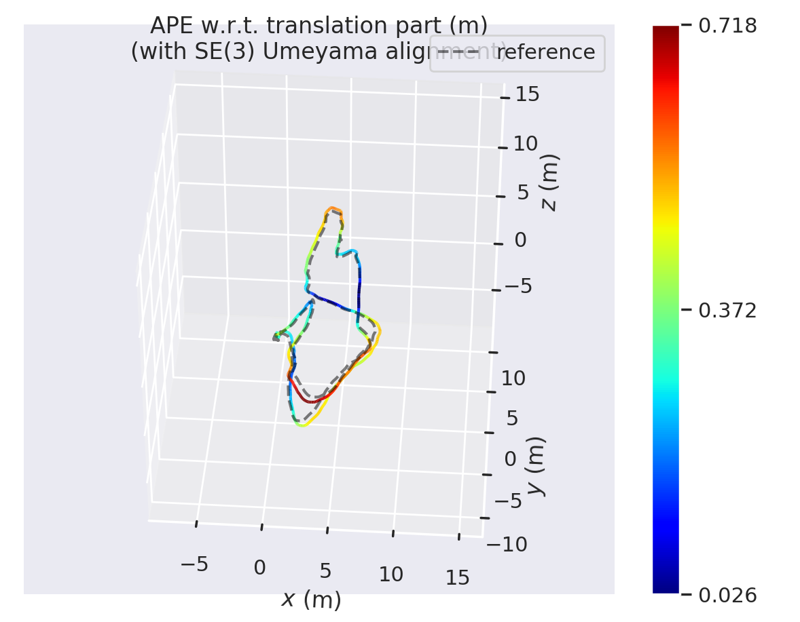
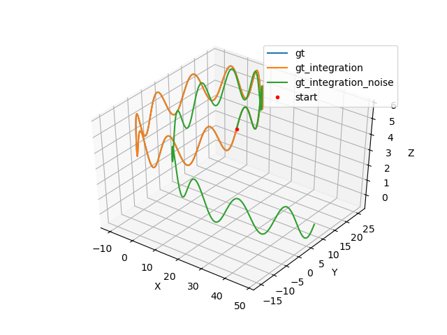
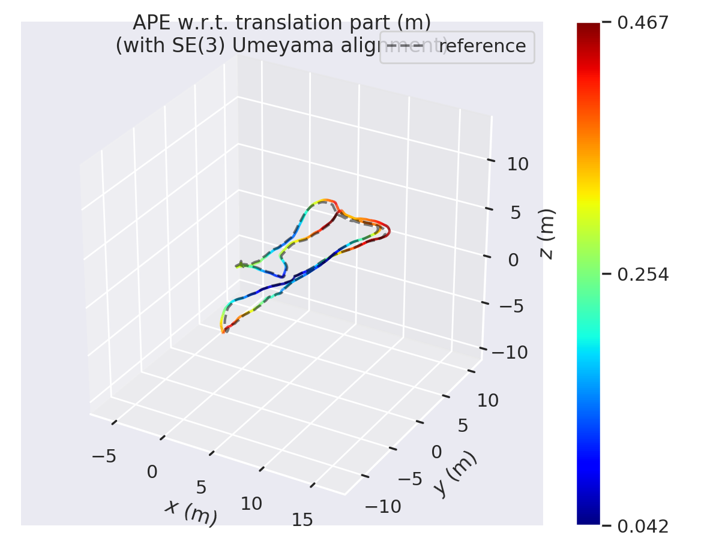

# Vins-Modern [(Continuously updating...)](https://github.com/weihaoysgs/vins-fast) :heart_eyes: 
<div align="center">

[English](README.md) | [Chinese](doc/Chinese.md)


</div>

VINS has been completely reconstructed and rewritten using C++ object-oriented, and supports stereo or stereo + IMU.


## Quick Start In Three Minutes :wink:

- **build**

$\quad$ The test completely passed on Ubuntu20.04 system

```shell
mkdir -p catkin_ws/src
cd catkin_ws/src
git clone https://github.com/weihaoysgs/vins-fast.git
cd ..
catkin_make -j
```

- **run**
```shell
source devel/setup.zsh # or source devel/setup.bash
roslaunch vins rviz.launch
# open new terminal
./build/vins-fast/vins/test_feature_track \
--config_file_path=/home/xx/catkin_ws/src/vins-fast/vins/config/euroc/euroc_stero.yaml
```
- **parameter**

$\quad$ maybe you need to change some parameter value in your `yaml` config file.
```shell
output_path: "/home/xx/catkin_ws/" # the vio trajectory result will save as TUM format
output_file_name: "vio.txt"

ros_bag_path: "/home/xx/dataset/euroc/MH_05_difficult.bag" 

cam0_calib: "/home/xx/catkin_ws/src/vins-fast/vins/config/euroc/cam0_mei.yaml"
cam1_calib: "/home/xx/catkin_ws/src/vins-fast/vins/config/euroc/cam1_mei.yaml"
```

## Stereo Only Mode Result :sunglasses:

The results of running on the [Euroc](https://projects.asl.ethz.ch/datasets/doku.php?id=kmavvisualinertialdatasets) dataset `MH_05_difficult` in stereo only mode. The accuracy is evaluated by the [EVO](https://github.com/MichaelGrupp/evo) tool, the RMSE is `0.40`

<div align="center">



</div>

## IMU Simulate Result :kissing_smiling_eyes:

Generate simulate IMU data through [vio-data-simulation](https://github.com/HeYijia/vio_data_simulation), verify whether the pre-integration results in the program are consistent with the normal integration results, and verify the correctness of the Jacobian matrix. You can even generate an entire VIO simulation dataset to verify your slam algorithm.

<div align="center">



</div>

## Stereo IMU Result :yum:

The stereo IMU mode is test success, the `evo_ape` result as follows, the RMSE is `0.240860`.

```shell
   max	0.400143
  mean	0.228765
median	0.221756
   min	0.063146
  rmse	0.240860
   sse	64.453061
   std	0.075366
```

<div align="center">



</div>

## Reference :stuck_out_tongue_winking_eye:

- [VINS-Fusion](https://github.com/HKUST-Aerial-Robotics/VINS-Fusion)
- [Vio-data-simulation](https://github.com/HeYijia/vio_data_simulation)

## TODO List

- [x] Add IMU to opt
- [ ] Add deep method
- [ ] Add other sensor
